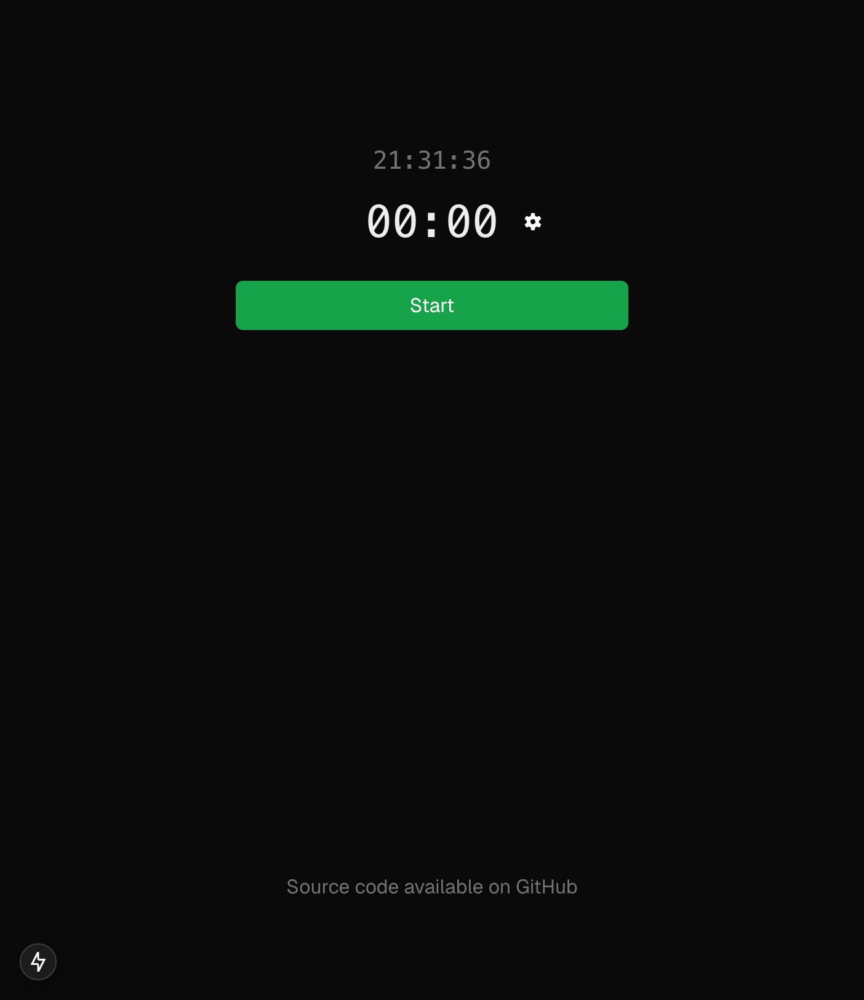
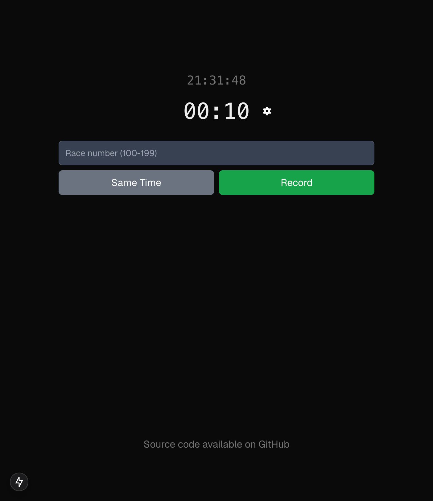
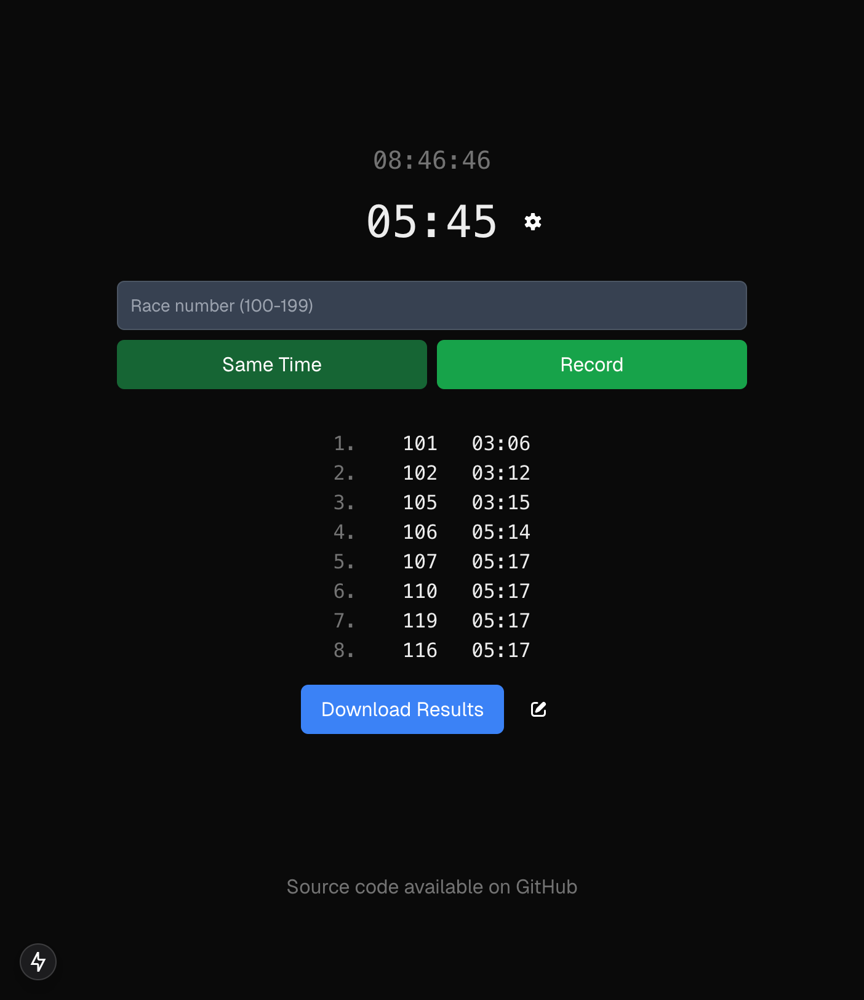
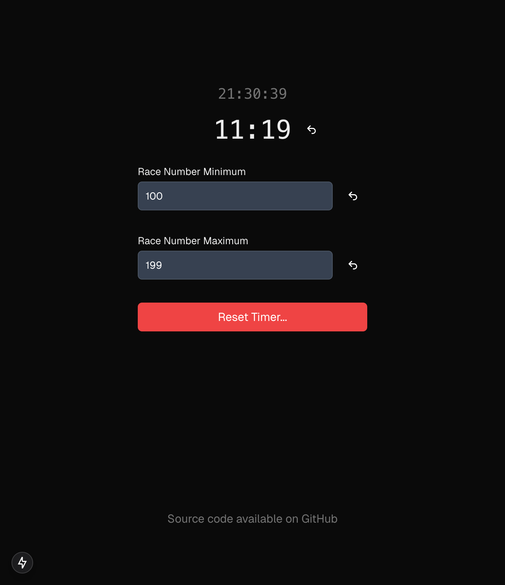

# Simple Race Timer

This is a truly minimal timer to manually time any small races. 
It's built to survive page refresh and can work off line (if not refreshed), but nothing more.

It's also built to be mobile friendly.

A deployed version of the application is available at [simple-race-timer.vercel.app](https://simple-race-timer.vercel.app/).

Have a good race!

## Overview and Features

The starting page displays a clock to let you hit the start button at the right time.


At that moment, the timer goes live! 
Then, on the finish line, it's only about providing the athlete's race number and record the time when crossing the finish line. 
For groups arriving to the finish line, the "same time" feature will let all race numbers have the same time (the order matter tho).


The results can be downloaded at any time in a csv format.


The recording doesn't provide any editing capabilities (yet), but will prevent having invalid or duplicated numbers. 
Also, the available race number range can be set in the settings.


The reset of the timer can also be done in the settings and will go through a confirmation.

## Running it locally

This is a [Next.js](https://nextjs.org) project bootstrapped with [`create-next-app`](https://nextjs.org/docs/app/api-reference/cli/create-next-app).

First, run the development server:

```bash
npm run dev
# or
yarn dev
# or
pnpm dev
# or
bun dev
```

Open [http://localhost:3000](http://localhost:3000) with your browser to see the result.
